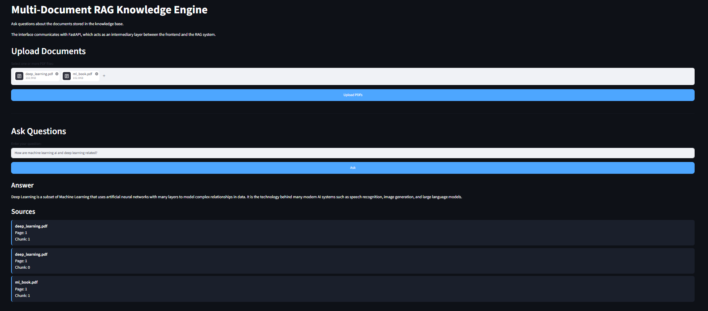
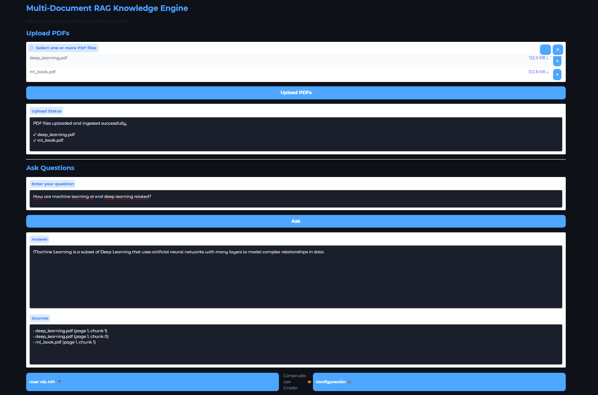
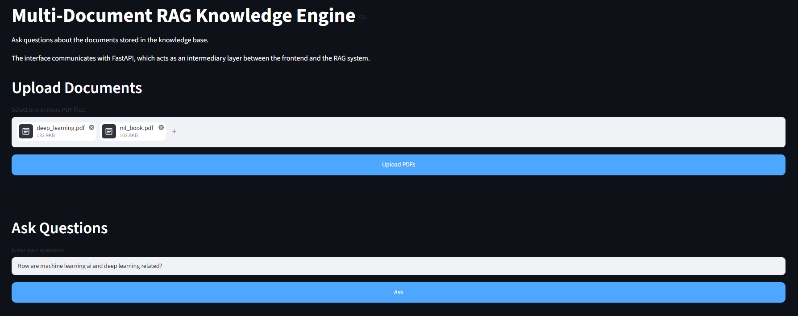
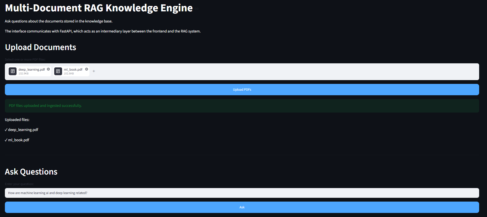

# Multi-Document RAG Knowledge Engine Platform

<p align="center">
  
  
  
  
  
  
  
  
  
</p>





A production-style Retrieval-Augmented Generation (RAG) system capable of ingesting multiple PDF documents, generating embeddings, performing semantic retrieval, and answering user questions with explicit source attribution.

The platform combines a FastAPI backend, ChromaDB vector storage, local large language models through Ollama, and two independent user interfaces built with Streamlit and Gradio. The project follows software engineering and MLOps best practices, including automated testing, static analysis, Docker support, and Continuous Integration with GitHub Actions.

## Project Goals

- Build a complete end-to-end RAG architecture using local LLMs.
- Support ingestion of multiple PDF documents into a persistent knowledge base.
- Provide transparent answers with page-level and chunk-level source references.
- Expose functionality through both REST APIs and graphical user interfaces.
- Apply production-oriented practices such as testing, type checking, linting, formatting, containerization, and CI pipelines.

## High-Level Workflow

PDF Documents
    ↓
PDF Loader
    ↓
Text Chunking
    ↓
Sentence Transformers Embeddings
    ↓
ChromaDB Vector Store
    ↓
Semantic Retrieval
    ↓
Prompt Construction
    ↓
Ollama (Llama 3)
    ↓
Answer + Source Attribution


## Key Features

### Multi-Document Knowledge Base

- Upload and process multiple PDF documents simultaneously.
- Incrementally expand the knowledge base without rebuilding the entire system.
- Persistent vector storage using ChromaDB.

### Semantic Retrieval

- Sentence Transformers embeddings for contextual understanding.
- Similarity search across document chunks.
- Configurable Top-K retrieval strategy.

### Source Attribution

- Every generated answer includes:
  - File name
  - Page number
  - Chunk identifier

- Transparent retrieval for improved trust and explainability.

### Dual User Interfaces

#### Streamlit Interface

- Modern dashboard-style experience.
- Multi-document upload support.
- Interactive question answering workflow.

#### Gradio Interface

- Lightweight conversational interface.
- Simple deployment model.
- Fast experimentation and demonstrations.

### REST API Backend

- FastAPI-powered backend services.
- Independent frontend and backend architecture.
- OpenAPI documentation available through `/docs`.

### Local LLM Execution

- Ollama integration for fully local inference.
- Llama 3 support.
- No external API keys required.
- Privacy-preserving document processing.

### Production Engineering Practices

- Automated testing with Pytest.
- Static analysis with Ruff.
- Formatting enforcement with Black.
- Type checking with MyPy.
- Continuous Integration using GitHub Actions.
- Docker support for reproducible deployments.

## System Architecture

The platform follows a modular Retrieval-Augmented Generation (RAG) architecture composed of independent user interfaces, a REST backend, a semantic retrieval layer, a vector database, and a local large language model.

```
User
  │
  ├──────────────┐
  │              │
  ▼              ▼
Streamlit UI   Gradio UI
  │              │
  └──────┬───────┘
         │
         ▼
      FastAPI
         │
         ▼
    RAG Pipeline
         │
  ┌──────┴───────┐
  │              │
  ▼              ▼
ChromaDB       Ollama
(Vector DB)    (Llama 3)
  ▲
  │
Sentence Transformers
  ▲
  │
PDF Loader → Text Chunker → Embeddings

```

### Architectural Components

#### User Interfaces

- Streamlit dashboard for interactive document exploration.
- Gradio interface for lightweight conversational interactions.
- Independent frontend applications communicating through REST APIs.

#### FastAPI Backend

- Central orchestration layer.
- Handles PDF uploads and question-answering requests.
- Exposes automatically generated OpenAPI documentation.

#### RAG Pipeline

- Retrieves semantically relevant document chunks.
- Builds contextual prompts.
- Invokes the local LLM for answer generation.
- Returns answers together with source attribution metadata.

#### ChromaDB

- Persistent vector database.
- Stores embeddings and document metadata.
- Enables efficient similarity search.

#### Ollama (Llama 3)

- Fully local inference engine.
- No external APIs or cloud dependencies.
- Privacy-preserving document processing.

#### Document Processing Layer

- PDF ingestion using PyPDF.
- Recursive text chunking.
- Embedding generation through Sentence Transformers.
- Incremental knowledge-base expansion without full reprocessing.

## Technology Stack

### Programming Language

- Python 3.10

### Backend Framework

- FastAPI
- Uvicorn

### User Interfaces

- Streamlit
- Gradio

### Large Language Models

- Ollama
- Llama 3 (local inference)

### Retrieval-Augmented Generation (RAG)

- Custom RAG pipeline implementation
- Prompt construction and contextual retrieval
- Source attribution and explainability mechanisms

### Embedding Models

- Sentence Transformers
- all-MiniLM-L6-v2 embedding model

### Vector Database

- ChromaDB

### Document Processing

- PyPDF
- LangChain Text Splitters
- Recursive Character Text Splitting

### Machine Learning & NLP

- Semantic similarity search
- Dense vector embeddings
- Information retrieval techniques
- Context-aware prompt engineering

### Software Engineering Tools

- Pytest
- Black
- Ruff
- MyPy
- Pre-commit

### Containerization

- Docker
- Docker Compose

### Continuous Integration

- GitHub Actions

### Development Environment

- Visual Studio Code
- Conda virtual environments
- PowerShell

### API Documentation

- OpenAPI
- Swagger UI

## Repository Structure

multi-document-rag-knowledge-engine-platform/
```

├── app/
│   ├── api/
│   │   ├── main.py
│   │   └── schemas.py
│   │
│   ├── ingestion/
│   │   ├── pdf_loader.py
│   │   ├── chunker.py
│   │   └── ingest_pdfs.py
│   │
│   ├── llm/
│   │   ├── ollama_client.py
│   │   └── rag_pipeline.py
│   │
│   ├── query/
│   │   └── query_knowledge_base.py
│   │
│   └── vectorstore/
│
├── ui_streamlit/
│   └── streamlit_app.py
│
├── ui_gradio/
│   └── gradio_app.py
│
├── tests/
│   └── unit/
│       ├── test_chunker.py
│       ├── test_pdf_loader.py
│       ├── test_query_knowledge_base.py
│       └── test_rag_pipeline.py
│
├── Dockerfiles/
│   ├── api.Dockerfile
│   ├── streamlit.Dockerfile
│   └── gradio.Dockerfile
│
├── .github/
│   └── workflows/
│       └── ci.yml
│
├── docs/
│   └── images/
│
├── data/
│
├── requirements.txt
├── docker-compose.yml
├── pyproject.toml
└── README.md
```

## Local Installation

### Clone the Repository

git clone https://github.com/Javier-DataScience/multi-document-rag-knowledge-engine-platform.git

cd multi-document-rag-knowledge-engine-platform


### Create a Virtual Environment

Using Conda:

conda create -n llm-env python=3.10

conda activate llm-env


### Install Dependencies

pip install -r requirements.txt


### Verify the Installation

Run the quality checks:

black --check .

ruff check .

mypy app ui_streamlit ui_gradio

pytest


Expected result:

- All tests should pass.
- Black should report no formatting issues.
- Ruff should report no linting errors.
- MyPy should complete without type-checking failures.


### Required Software

The following software must be installed on the local machine:

- Python 3.10
- Conda (recommended)
- Git
- Docker Desktop (optional)
- Ollama
- Visual Studio Code (recommended)


### Supported Operating Systems

- Windows 10 / 11
- Linux
- macOS (with minor adjustments if necessary)

## Ollama Setup

This project performs all inference locally using Ollama and Llama 3. No external APIs or cloud-based LLM providers are required.

### Install Ollama

Download and install Ollama from:

https://ollama.com/download


### Verify the Installation

Run:

ollama --version


### Pull the Llama 3 Model

Run:

ollama pull llama3


Depending on the hardware and internet connection, the download may take several minutes.


### Verify Available Models

Run:

ollama list


Expected output:

NAME       ID              SIZE
llama3     xxxxxxxxxxxx    xx GB


### Test Local Inference

Run:

ollama run llama3


Example:

>>> Explain what Retrieval-Augmented Generation means.

A Retrieval-Augmented Generation (RAG) system combines...


### Project Configuration

The application uses the following default model:

model = "llama3"


The model configuration is defined inside:

app/llm/ollama_client.py


### Design Philosophy

This project intentionally uses local inference to provide:

- Complete privacy for uploaded documents.
- No API costs.
- Offline capabilities.
- Full reproducibility.
- Independence from external LLM providers.

This design makes the platform suitable for educational, research, and enterprise environments where data confidentiality is important.

## Running the FastAPI Backend

The FastAPI application provides the core backend services responsible for:

- PDF ingestion
- Vector database interactions
- Semantic retrieval
- RAG orchestration
- LLM inference requests

### Start the Backend Server

Run:

uvicorn app.api.main:app --reload


Expected output:

INFO:     Uvicorn running on http://127.0.0.1:8000


### Open API Documentation

Swagger UI:

http://localhost:8000/docs


OpenAPI Schema:

http://localhost:8000/openapi.json


### Available Endpoints

POST /upload_pdfs

- Upload multiple PDF documents.
- Extract text and metadata.
- Generate embeddings.
- Insert chunks into ChromaDB.

POST /ask

- Receive a natural-language question.
- Retrieve relevant document chunks.
- Build a contextual prompt.
- Generate an answer using Llama 3.

GET /

- Health check endpoint.


### Example Workflow

1. Start Ollama:

ollama run llama3


2. Start FastAPI:

uvicorn app.api.main:app --reload


3. Open:

http://localhost:8000/docs


4. Upload PDF documents.

5. Ask questions through the API or the user interfaces.


### Development Notes

The --reload flag automatically restarts the server when source files are modified and should only be used during development.

For production environments, a standard Uvicorn execution without hot reloading is recommended.

## Running the Streamlit Interface

The Streamlit application provides an interactive dashboard for uploading documents, exploring the knowledge base, and performing Retrieval-Augmented Generation queries.

### Start the Interface

Open a new terminal and run:

streamlit run ui_streamlit/streamlit_app.py


Expected output:

You can now view your Streamlit app in your browser.

Local URL: http://localhost:8501


### Features

- Multi-document PDF upload.
- Automatic knowledge-base construction.
- Semantic search over embedded chunks.
- Question-answering using Llama 3.
- Source attribution and contextual responses.
- User-friendly dashboard interface.

### Local Access

Open:

http://localhost:8501


### Recommended Startup Order

1. Start Ollama:

ollama run llama3


2. Start the FastAPI backend:

uvicorn app.api.main:app --reload


3. Start Streamlit:

streamlit run ui_streamlit/streamlit_app.py


### Typical Workflow

- Upload one or multiple PDF documents.
- Wait for embeddings to be generated.
- Submit questions in natural language.
- Review generated answers and supporting context.

### Design Goals

The Streamlit interface was designed to provide:

- Fast experimentation.
- Educational demonstrations.
- Interactive document exploration.
- Lightweight local deployment.
- Simple integration with the FastAPI backend.

## Running the Gradio Interface

The Gradio application provides a lightweight conversational interface for interacting with the Retrieval-Augmented Generation system.

### Start the Interface

Open a new terminal and run:

python ui_gradio/gradio_app.py


Expected output:

Running on local URL:

http://127.0.0.1:7860


### Features

- Chat-style interaction with the knowledge base.
- Multi-document PDF upload.
- Natural-language question answering.
- Integration with FastAPI and Ollama.
- Local inference using Llama 3.
- Simple demonstration interface for rapid experimentation.

### Local Access

Open:

http://localhost:7860


### Recommended Startup Order

1. Start Ollama:

ollama run llama3


2. Start the FastAPI backend:

uvicorn app.api.main:app --reload


3. Start the Gradio application:

python ui_gradio/gradio_app.py


### Typical Workflow

- Upload one or more PDF documents.
- Build the semantic knowledge base.
- Ask questions through the chat interface.
- Receive context-aware answers generated by Llama 3.

### Design Goals

The Gradio frontend was designed to provide:

- Rapid prototyping capabilities.
- Conversational interactions.
- Easy demonstrations and presentations.
- Minimal setup requirements.
- Lightweight local deployment.

## Docker Deployment

The project includes container definitions for the FastAPI backend, Streamlit interface, and Gradio interface.

### Available Containers

- FastAPI backend
- Streamlit frontend
- Gradio frontend

### Build the Containers

Run:

docker compose build


### Start All Services

Run:

docker compose up


Expected exposed services:

FastAPI:

http://localhost:8000

Swagger UI:

http://localhost:8000/docs

Streamlit:

http://localhost:8501

Gradio:

http://localhost:7860


### Stop All Services

Run:

docker compose down


### Docker Architecture

FastAPI Container
        │
        ▼
   RAG Pipeline
        │
 ┌──────┴──────┐
 │             │
 ▼             ▼
ChromaDB    Ollama
        ▲
        │
Streamlit    Gradio


### Notes

- The primary development workflow for this project was fully validated using local execution.
- Docker support is provided as an optional deployment mechanism.
- Running all containers simultaneously may require significant memory resources depending on the local hardware configuration.
- Ollama and the Llama 3 model must be available from the host environment before performing end-to-end inference.

### Design Principles

The Docker setup was designed to provide:

- Reproducible environments.
- Isolation between services.
- Simplified deployment.
- Educational MLOps practices.
- Easy transition toward cloud-native architectures.

## Continuous Integration (GitHub Actions)

This project implements a fully automated Continuous Integration pipeline using GitHub Actions to ensure code quality, consistency, and reliability across all changes.

### CI Workflow Trigger

The pipeline runs automatically on:

- Push to the main branch
- Pull requests targeting main branch

### CI Pipeline Stages

The workflow executes the following steps sequentially:

1. Repository Checkout
2. Python Environment Setup
3. Dependency Installation
4. Code Formatting Check (Black)
5. Linting (Ruff)
6. Type Checking (MyPy)
7. Unit Tests (Pytest)

### Quality Gates

The pipeline enforces strict quality standards:

- Code must pass Black formatting validation
- Ruff must report no linting errors
- MyPy must complete without type errors
- Unit tests must pass successfully

### Test Strategy

The CI pipeline executes only **unit tests** to ensure fast and deterministic builds.

Tests requiring external dependencies such as:

- Local PDFs
- ChromaDB persistent state
- Ollama / Llama 3 inference

are executed locally and are not part of the CI pipeline.

### GitHub Actions Configuration

Workflow file location:

.github/workflows/ci.yml


### Design Principles

The CI system is designed with the following principles:

- Fast feedback loop for developers
- Reproducible execution environments
- Deterministic builds
- Separation between unit and integration tests
- Production-grade engineering practices

### Status

If all checks pass, the repository is considered:

✔ Code quality validated
✔ Type-safe
✔ Lint-compliant
✔ Functionally tested at unit level

## Screenshots & Demo

This section showcases the two user interfaces built for the Multi-Document RAG Knowledge Engine Platform: Streamlit and Gradio.

All screenshots represent real execution of the system running locally with Ollama (Llama 3) and ChromaDB.

---

### Streamlit Interface

#### Home Dashboard



The Streamlit dashboard provides a structured interface for uploading documents and interacting with the knowledge base. It is designed for exploration, analytics-style interaction, and multi-step workflows.

---

#### Document Upload & Processing



This view shows the document ingestion pipeline in action. Users can upload multiple PDFs, which are then processed, chunked, embedded, and stored in ChromaDB.

---

#### Question Answering Interface


The QA interface allows users to ask natural language questions over the uploaded documents. The system retrieves relevant chunks and generates contextual answers using Llama 3.

---

### Gradio Interface

#### Conversational RAG Interface


The Gradio interface provides a lightweight chat-based experience. It is optimized for fast interaction and demonstration purposes, allowing users to query the knowledge base in a conversational format.

---

### System Behavior Overview

Both interfaces share the same backend logic:

- PDF ingestion pipeline
- ChromaDB vector retrieval
- Sentence Transformer embeddings
- Ollama LLM inference (Llama 3)

This ensures consistency across UI layers while enabling multiple interaction styles.

---

### Demo Workflow

1. Upload PDF documents via Streamlit or Gradio.
2. System processes and stores embeddings in ChromaDB.
3. Ask questions in natural language.
4. Retrieve semantically relevant chunks.
5. Generate final answer using Llama 3.
6. Display answer with contextual grounding.

## Known Limitations

While the Multi-Document RAG Knowledge Engine Platform is fully functional and production-oriented in design, there are several known limitations inherent to its current implementation.

### Local LLM Dependency

- The system relies on Ollama running locally with the Llama 3 model.
- Performance and availability depend on local hardware resources.
- No fallback cloud LLM is implemented.

### Memory Constraints

- Large PDF documents may significantly increase memory usage during ingestion.
- Running multiple containers simultaneously (FastAPI, Streamlit, Gradio, Ollama) may require high system resources.
- Systems with limited RAM may experience slowdowns or instability.

### Simple Chunking Strategy

- The current chunking approach is rule-based and not semantically adaptive.
- More advanced chunking strategies (e.g., hierarchical or LLM-assisted chunking) are not implemented.

### Basic Retrieval Strategy

- ChromaDB similarity search uses a straightforward Top-K retrieval mechanism.
- No advanced reranking model is applied.

### No Persistent User Management

- The system does not support authentication or multi-user session isolation.
- All interactions are stateless from a user identity perspective.

### Limited Observability

- No logging dashboard or monitoring system is currently integrated.
- Debugging is performed via console logs.

### No Cloud Deployment

- The system is designed for local or containerized execution only.
- No Kubernetes or cloud-native deployment configuration is included.

## Future Improvements

The current version of the Multi-Document RAG Knowledge Engine Platform provides a solid functional and architectural baseline. However, several enhancements can be implemented to evolve the system into a more scalable, production-grade AI platform.

### Advanced Retrieval Techniques

- Implement reranking models (e.g., Cross-Encoders) to improve retrieval precision.
- Introduce hybrid search combining dense (vector) and sparse (BM25) retrieval.
- Explore query expansion techniques using LLMs.

### Improved Chunking Strategies

- Replace rule-based chunking with semantic or LLM-driven chunking.
- Implement hierarchical document structures for better context preservation.
- Add document structure awareness (headers, sections, tables).

### Model Enhancements

- Support multiple LLM backends (e.g., Mistral, Claude via API, GPT models).
- Implement dynamic model selection based on query complexity.
- Add fallback mechanisms when local LLM is unavailable.

### Performance Optimization

- Introduce caching layer for frequent queries.
- Optimize embedding generation with batching and async processing.
- Reduce memory footprint during ingestion pipeline execution.

### MLOps Expansion

- Add model versioning for embeddings and LLM configurations.
- Integrate experiment tracking (e.g., MLflow or Weights & Biases).
- Extend CI/CD to include integration tests with mocked LLM responses.

### Cloud Deployment

- Extend Docker setup to Kubernetes (K8s) deployment.
- Add cloud storage support (AWS S3 / Azure Blob Storage) for PDF ingestion.
- Deploy scalable API services using autoscaling groups.

### Observability & Monitoring

- Add structured logging across all services.
- Implement metrics tracking (latency, retrieval accuracy, token usage).
- Integrate monitoring dashboards (Prometheus + Grafana).

### Security & Multi-Tenancy

- Add authentication and authorization layer.
- Support user-level isolated knowledge bases.
- Implement API key management for external access.

### User Experience Enhancements

- Improve UI with chat history persistence.
- Add document preview functionality.
- Enable highlighting of source passages in answers.

## License

This project is licensed under the MIT License.

### MIT License Summary

Permission is hereby granted, free of charge, to any person obtaining a copy of this software and associated documentation files, to deal in the project without restriction, including but not limited to:

- Use
- Copy
- Modify
- Merge
- Publish
- Distribute
- Sublicense
- Sell copies of the software

### Conditions

The only requirement is that the original license and copyright notice must be included in all copies or substantial portions of the software.

### Disclaimer

The software is provided "as is", without warranty of any kind, express or implied, including but not limited to:

- Merchantability
- Fitness for a particular purpose
- Non-infringement

In no event shall the authors or copyright holders be liable for any claim, damages, or other liability arising from the use of the software.

## Author

AI Engineering project designed and implemented as a portfolio-grade, production-style end-to-end system demonstrating modern Machine Learning Engineering and LLM application design.

This project reflects hands-on experience in building full-stack AI systems, combining retrieval, generation, backend services, and user interfaces into a unified architecture.

### Focus Areas

- End-to-end Retrieval-Augmented Generation (RAG) systems
- Local LLM inference with Ollama and Llama 3
- Semantic search using embeddings and vector databases
- FastAPI-based backend architecture for AI services
- Multi-document ingestion and processing pipelines
- Document chunking and embedding generation strategies
- ChromaDB vector database integration
- Prompt engineering for LLM-based QA systems
- Dual interface development (Streamlit + Gradio)
- Docker-based containerization and service orchestration
- CI/CD pipelines using GitHub Actions
- Software engineering best practices (testing, linting, type checking)

### Project Stack Experience

- LLM Systems Design
- RAG Architecture Implementation
- Local AI Deployment (Ollama)
- Backend API Engineering (FastAPI)
- Frontend AI Applications (Streamlit / Gradio)
- MLOps Fundamentals (CI/CD, Docker, reproducibility)

### GitHub

https://github.com/Javier-DataScience